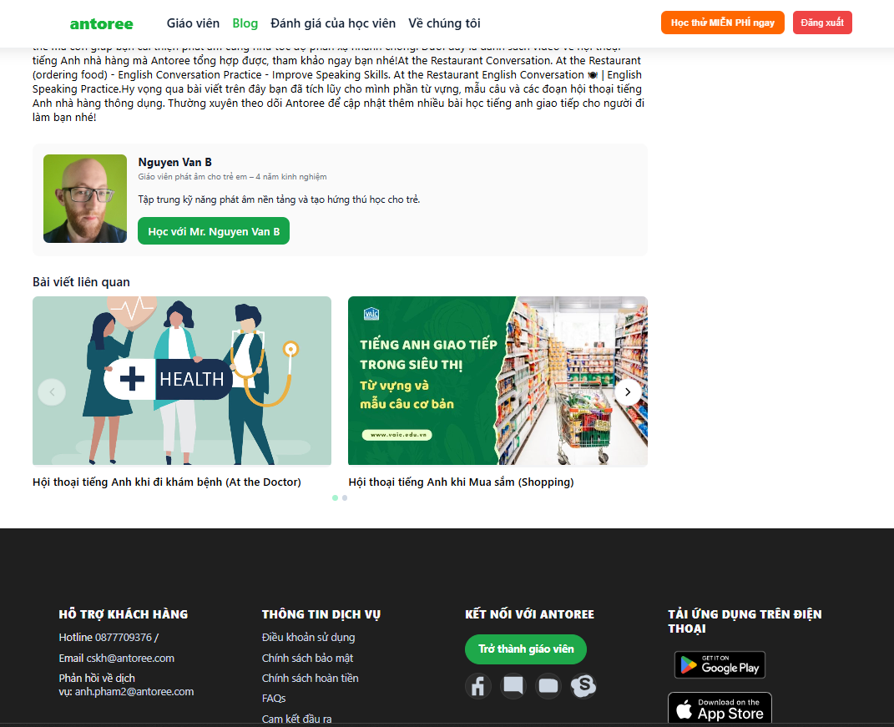

<h1 align="center">English Trading Platform</h1>

This is my solution to the Antoree tech test: an English tutoring marketplace project.

## Table of Contents
1. [Features](#features)
2. [Tech Stack](#tech-stack)
3. [Installation](#installation)
4. [Background](#background)

## Features

1. **User Registration and Authentication**
    - Implement a user registration and login system using JWT (JSON Web Token).
  
2. **User Roles**
    - Define different roles such as Admin, Lecturer, and Customer.
    - Each role has access to their respective dashboard:
        - Lecturer  have access to their own Lecturer dashboard.
        - Customers have access to their own customer dashboard.
        - Admins have access to their own admin dashboard.
3. **Blog Management**
   - Displays posts according to Blog Category.
   - Shows a “Viewest 3” section (sorted by view desc) and a “View All” link to the full list.
   - Shows Blog Detail includes: title, cover image, author, publish/update dates, category/tags, and full content. Extras:       breadcrumbs, related posts from the same category, TOC, and action buttons.
   - Internal links from detail pages back to category and to related posts.


## Tech Stack

[](https://reactjs.org/)

[](https://nestjs.com/)

[](https://www.mysql.org/)

[](https://jwt.io/)

[](https://render.com/)

[](https://supabase.io/)

## Installation

### Prerequisites

- [Node.js](https://nodejs.org/) installed
- [PostgreSQL](https://www.mysql.org/) installed

### Backend Setup

1. Clone the repository:
    ```sh
    git clone https://github.com/chrispsang/Booking-System.git
    cd Booking-System/booking-system-backend
    ```

2. Install dependencies:
    ```sh
    npm install
    ```

3. Set up the environment variables in a `.env` file:
    ```plaintext
    DATABASE_HOST=
    DATABASE_PORT=
    DATABASE_USERNAME=
    DATABASE_PASSWORD=
    DATABASE_NAME=
    ```

4. Run the backend server (default port 3000):
    ```sh
    npm run start
    ```

### Frontend Setup

1. Navigate to the frontend directory:
    ```sh
    cd ../booking-system-frontend
    ```

2. Install dependencies:
    ```sh
    npm install
    ```

3. Set up the environment variables:
    - For development: Create a `.env.development` file with the following content:
      ```plaintext
      REACT_APP_API_URL=http://localhost:3000
      ```
      
4. Run the frontend server (default port 3001):
    ```sh
    npm start
    ```

You can access the frontend at [http://localhost:3001](http://localhost:3001) for development. The backend can be accessed at [http://localhost:3000](http://localhost:3000) for development.

##Background
### Lecturer Search 

### Blog List

### Blog View



