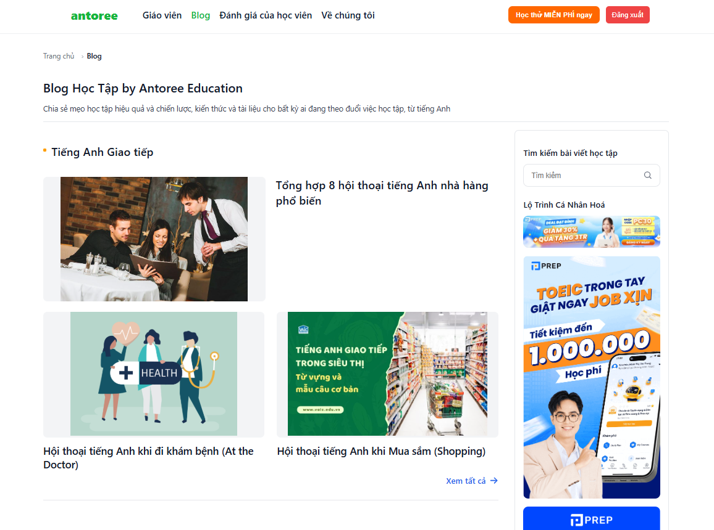
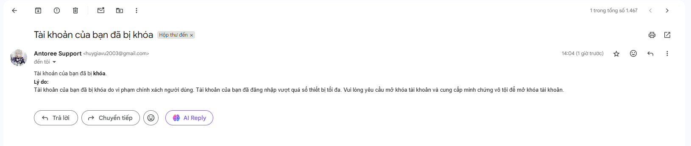

<h1 align="center">English Trading Platform</h1>

This is my solution to the Antoree tech test: an English tutoring marketplace project.

## Table of Contents
1. [Features](#features)
2. [Tech Stack](#tech-stack)
3. [Installation](#installation)
4. [Background](#background)

## Features

1. **User Registration and Authentication**
    - Implement a user registration and login system using JWT (JSON Web Token).
  
2. **User Roles**
    - Define different roles such as Admin, Lecturer, and Customer.
    - Each role has access to their respective dashboard:
        - Lecturer  have access to their own Lecturer dashboard.
        - Customers have access to their own customer dashboard.
        - Admins have access to their own admin dashboard.
3. **Blog Management**
   - Displays posts according to Blog Category.
   - Shows a “Viewest 3” section (sorted by view desc) and a “View All” link to the full list.
   - Shows Blog Detail includes: title, cover image, author, publish/update dates, category/tags, and full content. Extras:       breadcrumbs, related posts from the same category, TOC, and action buttons.
   - Internal links from detail pages back to category and to related posts.


## Tech Stack

[](https://reactjs.org/)

[](https://nestjs.com/)

[](https://www.mysql.org/)

[](https://jwt.io/)

[](https://render.com/)

[](https://supabase.io/)

## Installation

### Prerequisites

- [Node.js](https://nodejs.org/) installed
- [MySQL](https://www.mysql.org/) installed

### Backend Setup

1. Clone the repository:
    ```sh
    git clone https://github.com/HuyLearnProgram/english-trading-platform.git
    cd /english-trading-platform/english-trading-platform-backend
    ```

2. Install dependencies:
    ```sh
    npm install
    ```

3. Set up the environment variables in a `.env` file:
    ```plaintext
    DATABASE_HOST=localhost
    DATABASE_PORT=3306
    DATABASE_USERNAME=root
    DATABASE_PASSWORD=123456
    DATABASE_NAME=booking_db
    PORT=3000

    BACKEND_URL=http://localhost:3000
    FRONTEND_URL=http://localhost:3001
    
    # JWT Config
    JWT_ACCESS_SECRET="X7+HdDTQjSdnyGc2ALiumB7tVD6+g+eWcefZ4blz9BQ="
    JWT_ACCESS_TTL=15m
    
    JWT_REFRESH_SECRET="Vq8a8l3e5q5kq0m9x1C2pUTf0Cj4Qe7m2vK9yZ0w3sA="
    JWT_REFRESH_TTL=30d   
    
    # Redis Config
    REDIS_HOST=
    REDIS_PORT=
    REDIS_USERNAME=
    REDIS_PASSWORD=
    
    REDIS_TLS=false
    NODE_ENV=development

    # SMTP Config
    SMTP_USER=
    SMTP_PORT=587
    SMTP_HOST=smtp.gmail.com
    SMTP_PASS=
    MAIL_FROM=
    
    # Google OAuth Config
    GOOGLE_CLIENT_ID=
    GOOGLE_CLIENT_SECRET=
    GOOGLE_CALLBACK_URL=


    # VNPAY sandbox
    VNP_TMN_CODE=
    VNP_HASH_SECRET=
    VNP_PAYMENT_URL=https://sandbox.vnpayment.vn/paymentv2/vpcpay.html
    VNP_RETURN_URL=http://localhost:3000/payments/vnpay/return-dev
    VNP_IPN_URL=http://localhost:3000/payments/vnpay/ipn             
    
    
    # ZALOPAY (Sandbox)
    ZLP_APP_ID=553
    ZLP_KEY1=9phuAOYhan4urywHTh0ndEXiV3pKHr5Q
    ZLP_KEY2=eG4r0GcoNtRGbO8         
    ZLP_CREATE_ORDER_URL=https://sandbox.zalopay.com.vn/v001/tpe/createorder
    # Người dùng quay về sau thanh toán (có thể dùng FE)
    ZLP_RETURN_URL=http://localhost:3001/checkout/result
    # IPN (public). Test local dùng ngrok để public endpoint này
    ZLP_CALLBACK_URL=http://localhost:3000/payments/zalopay/callback
    
    # Paypal (Sandbox)
    # PayPal
    PAYPAL_CLIENT_ID=
    PAYPAL_CLIENT_SECRET=
    PAYPAL_ENV=sandbox
    PAYPAL_CURRENCY=USD
    # Nếu giá của bạn đang là VND, tạm convert sang USD để test (tùy bạn set)
    PAYPAL_VND_USD=24000
    PAYPAL_RETURN_URL=http://localhost:3000/payments/paypal/return-dev
    PAYPAL_CANCEL_URL=http://localhost:3000/payments/paypal/cancel-dev
   
    ```

4. Run the backend server (default port 3000):
    ```sh
    npm run start
    ```

### Frontend Setup

1. Navigate to the frontend directory:
    ```sh
    cd ../english-trading-platform-frontend
    ```

2. Install dependencies:
    ```sh
    npm install
    ```

3. Set up the environment variables:
    - For development: Create a `.env.development` file with the following content:
      ```plaintext
      REACT_APP_API_URL=http://localhost:3000
      ```
      
4. Run the frontend server (default port 3001):
    ```sh
    npm start
    ```

You can access the frontend at [http://localhost:3001](http://localhost:3001) for development. The backend can be accessed at [http://localhost:3000](http://localhost:3000) for development.


## Background
### Login


### Notification

### Lecturer Search 

### Lecturer Profile


### Blog List


### Blog View


## Consultation


## User manager


## Order

## Checkout/ Payment
.png)


